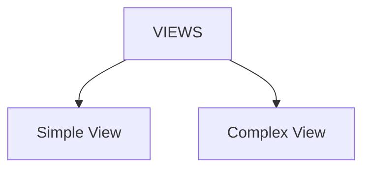

# VIEWS

Views are virtual tables that are based on the result of an SQL statement. They do not store data themselves but provide a way to simplify complex queries or restrict access to certain data in the database.

**DDL defines schema objects, and a view is considered a schema object.**



**Example:**

```sql
CREATE VIEW employee_info AS
SELECT e.id, e.name, e.email, d.name AS department_name
FROM employees e
JOIN departments d ON e.department_id = d.id;
```

This example creates a view named `employee_info` that combines data from the `employees` and `departments` tables. The view can be queried like a regular table, providing a simplified interface for accessing the joined data.

```sql
SELECT * FROM employee_info;
```
This query retrieves all records from the `employee_info` view, which will return the employee's id, name, email, and their corresponding department name.