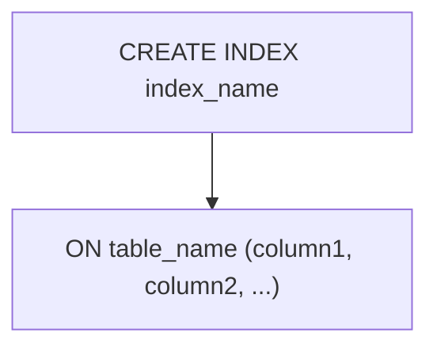

# INDEX
An index in SQL is a data structure that improves the speed of data retrieval operations on a table. You can think of it like the index at the back of a book: instead of scanning every page, the database can jump directly to the relevant rows.

The syntax for creating an index is as follows:

```sql
CREATE INDEX index_name
ON table_name (column1, column2, ...);
```

- `index_name`: The name of the index you want to create.
- `table_name`: The name of the table on which you want to create the index.
- `column1`, `column2`, ...: The columns that you want to include in the index. You can create an index on one or more columns.



**Example:**

```sql
CREATE INDEX idx_employee_name
ON employees (name);
```
In this example, we create an index named `idx_employee_name` on the `name` column of the `employees` table. This index will help speed up queries that search for employees by their name.