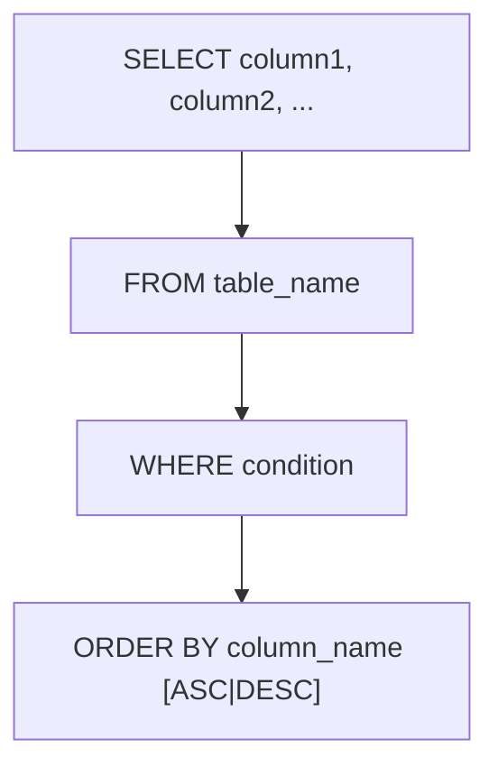

# SELECT
The `SELECT` statement is used to retrieve data from one or more tables in a database. It allows you to specify which columns to retrieve, filter the results based on certain conditions, and sort the results in a specific order.

The basic syntax for a `SELECT` statement is as follows:

```sql
SELECT column1, column2, ...
FROM table_name
WHERE condition
ORDER BY column_name [ASC|DESC];
```

- `column1`, `column2`, ...: The names of the columns you want to retrieve. You can use `*` to select all columns.
- `table_name`: The name of the table from which you want to retrieve data.
- `WHERE condition`: Optional. A condition to filter the results (e.g., `age > 30`).
- `ORDER BY column_name [ASC|DESC]`: Optional. Sort the results by a specific column in ascending (ASC) or descending (DESC) order.



**Example:**

```sql
SELECT name, age
FROM employees
WHERE age > 30
ORDER BY age DESC;
```
This example retrieves the `name` and `age` columns from the `employees` table for all employees whose age is greater than 30. The results are sorted by age in descending order, meaning the oldest employees will appear first in the result set.