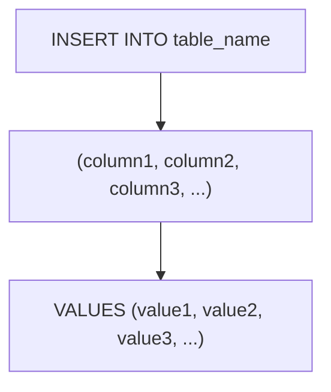

# INSERT
The `INSERT` statement is used to add new records to a table in a SQL database. The basic syntax for the `INSERT` statement is as follows:

```sql
INSERT INTO table_name (column1, column2, column3, ...)
VALUES (value1, value2, value3, ...);
```

- `table_name`: The name of the table you want to insert data into.
- `column1`, `column2`, `column3`, ...: The names of the

columns in the table where you want to insert data. This is optional if you are inserting values for all columns in the correct order.

- `value1`, `value2`, `value3`, ...: The values to be inserted into the specified columns. The order of the values must match the order of the columns.



**Example:**

```sql
INSERT INTO employees (id, name, position, salary)
VALUES (1, 'John Doe', 'Software Engineer', 75000.00);
INSERT INTO employees (id, name, position, salary)
VALUES (2, 'Jane Smith', 'Data Analyst', 65000.00);
```
This example inserts two new records into the `employees` table. The first record has an `id` of 1, a `name` of 'John Doe', a `position` of 'Software Engineer', and a `salary` of 75000.00. The second record has an `id` of 2, a `name` of 'Jane Smith', a `position` of 'Data Analyst', and a `salary` of 65000.00.