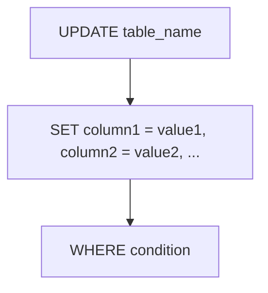

# UPDATE
The `UPDATE` statement is used to modify existing records in a table. It allows you to change the values of one or more columns for all rows that match a specified condition.

The basic syntax for the `UPDATE` statement is as follows:

```sql
UPDATE table_name
SET column1 = value1, column2 = value2, ...
WHERE condition;
```

- `table_name`: The name of the table you want to update.
- `column1`, `column2`, ...: The names of the columns you want to update.
- `value1`, `value2`, ...: The new values to assign to the specified columns.
- `WHERE condition`: A condition to specify which rows should be updated. If you omit the `WHERE` clause, all rows in the table will be updated.



**Example:**

```sql
UPDATE employees
SET salary = salary * 1.10
WHERE position = 'Software Engineer';
```
This example updates the `salary` column for all employees whose `position` is 'Software Engineer' by increasing their salary by 10%.
