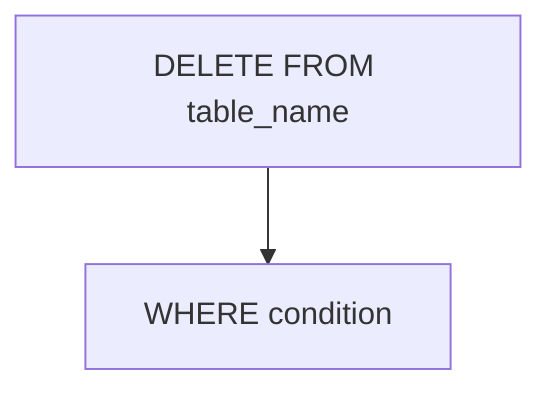

# DELETE
The `DELETE` statement is used to remove records from a table in a database. It allows you to specify which records to delete based on certain conditions.

The basic syntax for the `DELETE` statement is as follows:

```sql
DELETE FROM table_name
WHERE condition;
```

- `table_name`: The name of the table from which you want to delete records.
- `WHERE condition`: A condition to specify which records should be deleted. If you omit the `WHERE` clause, all records in the table will be deleted.



**Example:**

```sql
DELETE FROM employees
WHERE position = 'Data Analyst';
```

This example deletes all records from the `employees` table where the `position` is 'Data Analyst'. If there are multiple employees with that position, all of them will be deleted from the table.