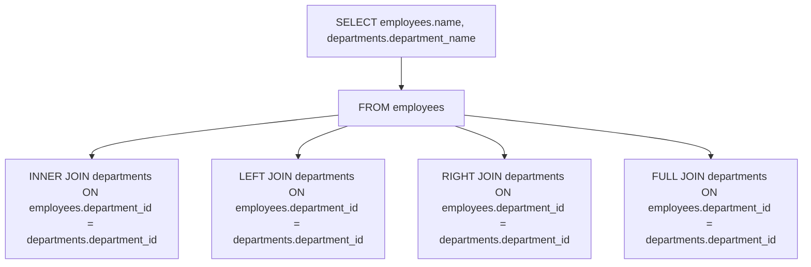
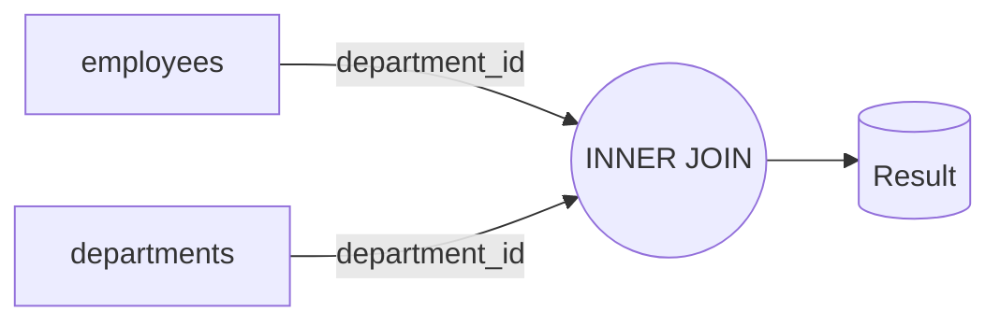
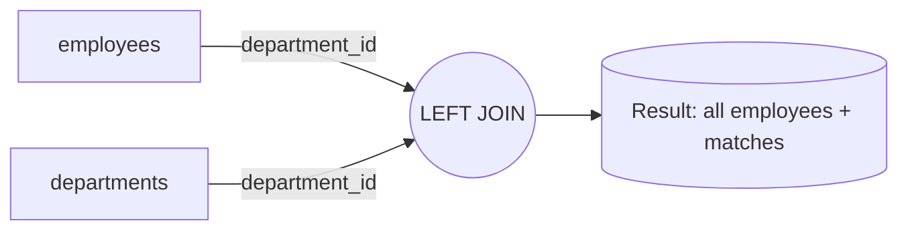
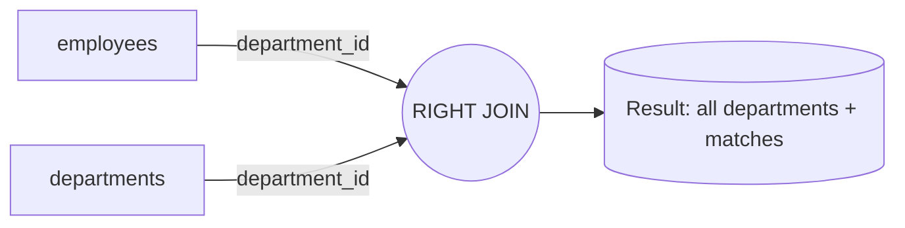
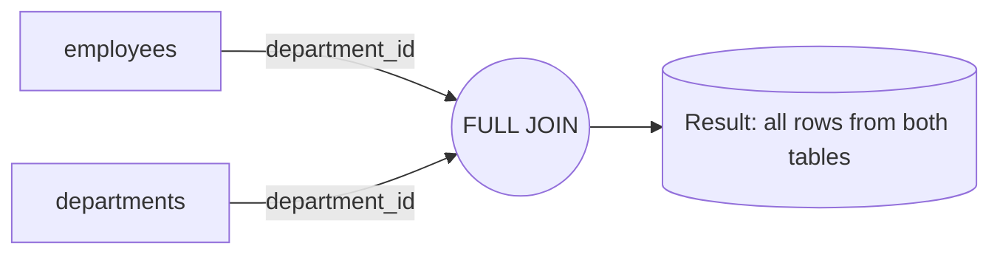

# JOINS
**JOIN = two tables to one resultset (no new tables created)**

JOINS are used to combine rows from two or more tables based on a related column between them.
The most common types of JOINS are:

- **INNER JOIN:** Returns records that have matching values in both tables.
- **LEFT JOIN (or LEFT OUTER JOIN):** Returns all records from the left table, and the matched records from the right table. If there is no match, the result is NULL on the right side.
- **RIGHT JOIN (or RIGHT OUTER JOIN):** Returns all records from the right table, and the matched records from the left table. If there is no match, the result is NULL on the left side.
- **FULL JOIN (or FULL OUTER JOIN):** Returns all records when there is a match in either left or right table. If there is no match, the result is NULL on the side that does not have a match.




## **Use Cases**
Data:


| employee_id | name    | department_id |
|-------------|---------|---------------|
| 1           | Alice   | 10            |
| 2           | Bob     | 20            |
| 3           | Charlie | NULL          |
| 4           | Diana   | 30            |
| 5           | Eve     | 99            |

| department_id | department_name |
|---------------|-----------------|
| 10            | HR              |
| 20            | IT              |
| 30            | Finance         |
| 40            | Marketing       |


    

### **INNER JOIN:**
```sql
SELECT employees.name, departments.department_name
FROM employees
INNER JOIN departments ON employees.department_id = departments.department_id;
```
This example retrieves the names of employees along with their corresponding department names by performing an INNER JOIN between the `employees` and `departments` tables based on the `department_id` column. Only records with matching `department_id` in both tables will be included in the result.



| name    | department_name |
|---------|-----------------|
| Alice   | HR              |
| Bob     | IT              |
| Diana   | Finance         |

### **LEFT JOIN:**
```sql
SELECT employees.name, departments.department_name
FROM employees
LEFT JOIN departments ON employees.department_id = departments.department_id;
``` 
This example retrieves the names of employees along with their corresponding department names by performing a LEFT JOIN between the `employees` and `departments` tables. All employees will be included in the result, and if an employee does not belong to any department, the `department_name` will be NULL.



| name    | department_name |
|---------|-----------------|
| Alice   | HR              |
| Bob     | IT              |
| Charlie | NULL            |
| Diana   | Finance         |
| Eve     | NULL            |

### **RIGHT JOIN:**
```sql
SELECT employees.name, departments.department_name
FROM employees
RIGHT JOIN departments ON employees.department_id = departments.department_id;
```
This example retrieves the names of employees along with their corresponding department names by performing a RIGHT JOIN between the `employees` and `departments` tables. All departments will be included in the result, and if a department does not have any employees, the `name` will be NULL.



| name    | department_name |
|---------|-----------------|
| Alice   | HR              |
| Bob     | IT              |
| Diana   | Finance         |
| NULL    | Marketing       |

### **FULL JOIN:**
```sql
SELECT employees.name, departments.department_name
FROM employees
FULL JOIN departments ON employees.department_id = departments.department_id;
```
This example retrieves the names of employees along with their corresponding department names by performing a FULL JOIN between the `employees` and `departments` tables. All records from both tables will be included in the result, and if there is no match, the corresponding fields will be NULL.



| name    | department_name |
|---------|-----------------|
| Alice   | HR              |
| Bob     | IT              |
| Charlie | NULL            |
| Diana   | Finance         |
| Eve     | NULL            |
| NULL    | Marketing       |