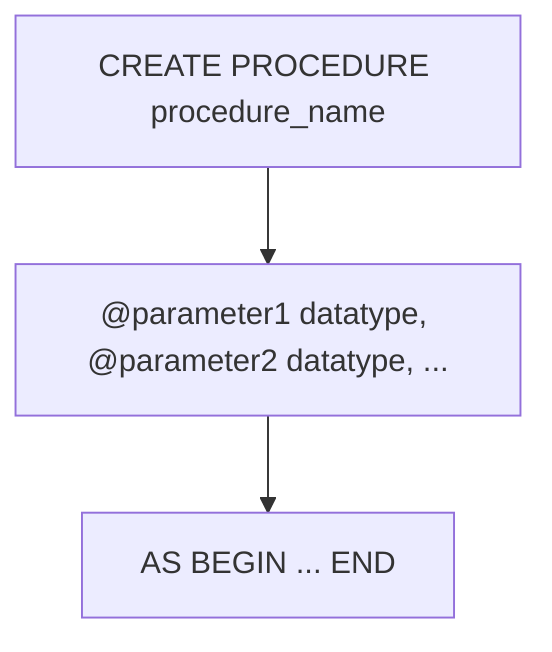

# STORED PROCEDURE
A stored procedure is a precompiled collection of SQL statements and optional control-of-flow statements that are stored under a name and processed as a unit. Stored procedures can accept parameters, perform operations, and return results. They are commonly used to encapsulate business logic, improve performance, and enhance security.

The syntax for creating a stored procedure is as follows:

```sql
CREATE PROCEDURE procedure_name
    @parameter1 datatype,
    @parameter2 datatype,
    ...
AS
BEGIN
    -- SQL statements go here
END;
```

- `procedure_name`: The name of the stored procedure.
- `@parameter1`, `@parameter2`, ...: The parameters that the stored procedure accepts, along with their data types.
- The `AS BEGIN ... END` block contains the SQL statements that define the logic of the stored procedure.



**Example:**

```sql
CREATE PROCEDURE GetEmployeeById
    @EmployeeId INT
AS
BEGIN
    SELECT * FROM employees
    WHERE id = @EmployeeId;
END;
```
In this example, we create a stored procedure named `GetEmployeeById` that takes an integer parameter `@EmployeeId`. The procedure retrieves the employee record from the `employees` table where the `id` matches the provided `@EmployeeId`.