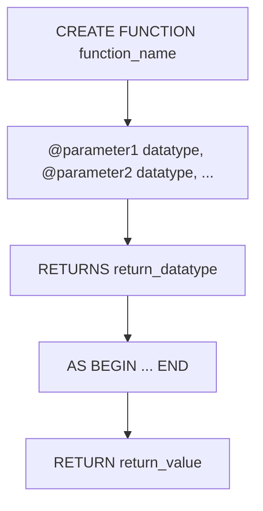

# FUNCTION
A **function** is a reusable block of code that performs a specific task and returns a
value. Functions can accept parameters, execute SQL statements, and return results. They are commonly used to encapsulate logic that can be reused across multiple queries or applications.
## Syntax
The syntax for creating a function is as follows:

```sql
CREATE FUNCTION function_name
    (@parameter1 datatype, @parameter2 datatype, ...)
RETURNS return_datatype
AS
BEGIN
    -- SQL statements go here
    RETURN return_value;
END;
```

- `function_name`: The name of the function.
- `@parameter1`, `@parameter2`, ...: The parameters that the function accepts, along with their data types.
- `return_datatype`: The data type of the value that the function will return.
- The `AS BEGIN ... END` block contains the SQL statements that define the logic of the function, and the `RETURN` statement specifies the value that the function will return.


## Example
```sql
CREATE FUNCTION GetEmployeeFullName
    (@EmployeeId INT)
RETURNS VARCHAR(255)
AS
BEGIN
    DECLARE @FullName VARCHAR(255);
    SELECT @FullName = CONCAT(first_name, ' ', last_name)
    FROM employees
    WHERE id = @EmployeeId;
    RETURN @FullName;
END;
```
In this example, we create a function named `GetEmployeeFullName` that takes an integer parameter `@EmployeeId` and returns a string (VARCHAR) containing the full name of the employee. The function concatenates the `first_name` and `last_name` from the `employees` table based on the provided employee ID and returns the full name.