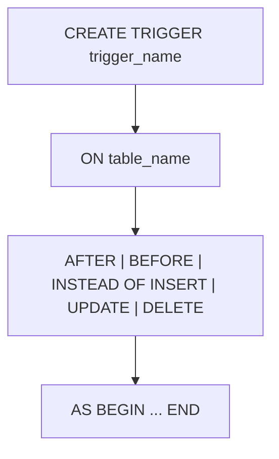

# TRIGGER
A **trigger** is a database object that automatically executes a specified action in response to certain events on a particular table or view. Triggers are commonly used for enforcing business rules, maintaining audit trails, and ensuring data integrity.

The syntax for creating a trigger is as follows:

```sql
CREATE TRIGGER trigger_name
ON table_name
AFTER|BEFORE|INSTEAD OF INSERT|UPDATE|DELETE
AS
BEGIN
    -- SQL statements to execute when the trigger is fired
END;
```

- `trigger_name`: The name of the trigger.
- `table_name`: The name of the table or view on which the trigger is defined.
- `AFTER|BEFORE|INSTEAD OF`: Specifies when the trigger should be executed in relation to the triggering event.
- `INSERT|UPDATE|DELETE`: Specifies the type of event that will fire the trigger.
- The `AS BEGIN ... END` block contains the SQL statements that define the logic of the trigger.


**Example:**

```sql
CREATE TRIGGER trg_AuditEmployeeChanges
ON employees
AFTER UPDATE
AS
BEGIN
    INSERT INTO employee_audit (employee_id, change_date, old_salary, new_salary)
    SELECT id, GETDATE(), deleted.salary, inserted.salary
    FROM inserted
    JOIN deleted ON inserted.id = deleted.id;
END;
```
In this example, we create a trigger named `trg_AuditEmployeeChanges` that fires after an update on the `employees` table. The trigger inserts a record into the `employee_audit` table, capturing the employee's ID, the date of the change, the old salary, and the new salary whenever an employee's salary is updated.